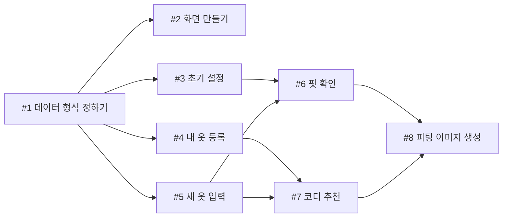

# 5주차 활동지 / Week 5 Worksheet

**1-page 기획서 / One-page plan**

- 작성일 / Date: 2026.10.02 
- 참여자 / Present: 정준영,허정민,장동호,김현빈

---

## ① 주제 확정 / Confirm topic

- 확정 주제 / Topic: 내 방 옷장의 옷과 새옷의 조합 확인하기
- 이유 / Reason: 온라인 의류 쇼핑은 직접 입어볼 수 없어서 사이즈나 핏이 맞을지 걱정하는 사람들이 많기 때문에 다른 후보들보다 사업성이 높다고 판단했습니다.

---

## ② 태스크 분해와 의존 관계 / Tasks and dependencies

### 태스크 목록 / Task list

4주차 사용자 스토리와 완료 조건을 태스크로 나눕니다.
*Break down your Week 4 user stories and acceptance criteria into tasks.*

각 태스크는 따로 끝내도 맞는지 확인할 수 있어야 합니다. 담당에 '다 같이'는 쓰지 않습니다.
*Each task must be checkable on its own. Do not write "everyone" as owner.*

| # | 태스크 | 완료 조건 | 선행 | 담당 |
|---|---|---|---|---|
| 1 | 데이터 형식 정하기 | 신체 치수, 내 옷, 새 옷 실측, 판정 결과에 들어갈 항목이 문서로 정리됨 | 없음 | 허정민 |
| 2 | 화면 만들기 | 내 정보 입력 → 옷 등록 → 결과 보기 화면을 만들고, 임시 값으로 버튼을 눌러 화면이 넘어가는지 확인함 | 1 | 허정민 |
| 3 | 초기 설정 | 성별·연령대·키·몸무게 입력 → 핏 판정에 필요한 세부 치수(가슴·어깨·팔길이·허리·엉덩이) 자동 추정 → 사용자가 확인·수정 | 1 | 정준영 |
| 4 | 내 옷 등록 | 사진을 찍으면 배경이 지워지고 카테고리·색상이 추정되어 확인할 수 있고, 드롭다운으로 카테고리·색상만 골라 등록할 수도 있음 | 1 | 장동호 |
| 5 | 새 옷 입력 | 상품 이미지와 사이즈표 캡처를 올리면 실측이 자동 추출되고, 사용자가 확인할 수 있음 | 1 | 장동호 |
| 6 | 핏 확인 | 신체 치수와 새 옷 실측으로 부위별 여유분 계산 → 데이터 기반 기준으로 타이트/적당/여유 판정, 사이즈가 여러 개면 가장 맞는 사이즈 추천 | 3, 5 | 정준영 |
| 7 | 코디 추천 | 새 옷 카테고리에 따라 슬롯 구성(상의 → 하의·아우터, 하의 → 상의·아우터, 아우터 → 상의·하의, 원피스 → 아우터) → 슬롯별 후보 전체를 Jev에 넘겨 최적 조합 선택. 확신도 높으면 1개, 낮으면 2~3개 제시 | 4, 5 | 김현빈 |
| 8 | 피팅 이미지 생성 | 체형 묘사 + 핏 판정 결과 + 조합 옷 이미지로 프롬프트 생성 → Higgsfield 호출(나노바나나, gpt image 등) → 결과를 기기에 저장 | 6, 7 | 김현빈 |

### 의존 관계 그래프 / Dependency graph (DAG)

화살표는 "앞 태스크가 끝나야 뒤 태스크를 할 수 있다"는 뜻입니다.
*An arrow means the first task must finish before the second can start.*

**그리는 방법 / How to draw**
- 아래 예시에서 상자 이름을 바꾸고, 선후 관계 하나마다 화살표(`-->`) 줄을 하나씩 추가합니다. GitHub에서 파일을 열면 그림으로 보입니다. 미리 보려면 mermaid.live에 붙여 넣으세요.
  *Rename the boxes and add one `-->` line per dependency. GitHub shows it as a diagram. Preview at mermaid.live.*
- 태스크 표를 AI에게 주고 "Mermaid 그래프로 바꿔 줘"라고 요청해도 됩니다.
  *You can also give the task table to AI and ask "Convert this into a Mermaid graph."*
- 어려우면 종이에 그려 사진을 `docs/images/`에 올리고 ``로 넣어도 됩니다.
  *Or draw it on paper, upload the photo to `docs/images/` and link it with ``.*

- 지금 착수 가능 (진입 차수 0) / Can start now (in-degree 0): #1
- 작업 순서 (위상정렬) / Work order (topological sort):
  - 1단계: #1
  - 2단계 (동시 진행): #2, #3, #4, #5
  - 3단계 (동시 진행): #6, #7
  - 4단계: #8
- 사이클이 있었다면 어떻게 풀었는가 / If there was a cycle, how did you fix it?: 화면과 기능이 서로 주고받을 형식을 기다리는 사이클이 생길 뻔해서, "데이터 형식 정하기"(#1)를 맨 앞으로 빼서 풀었다.

---

## ③ 범위 결정 / Scope

### Must — 없으면 성립 안 됨 / essential

핵심 시나리오 1개가 끝까지 동작하는 데 필요한 것만 / *Only what the core scenario needs to work end-to-end*
 
- 핵심 시나리오 / Core scenario: 체형 정보를 입력하고 내 옷을 등록한 뒤 → 새 옷의 상품 이미지와 사이즈표를 올리면 → 부위별 핏 판정과 가장 맞는 사이즈, 내 옷과의 코디 조합을 알려주고 → 그 조합을 입은 피팅 이미지가 나온다
 

### Should (없을 경우에는 작성하지 마세요)
 
 - 시나리오

### Could (없을 경우에는 작성하지 마세요)

 - 시나리오

### **Won't — 이번 학기에 안 함 / not this semester**

| Won't 항목 Item | 포기한 이유 Why |
|---|---|
| 신발·가방·액세서리 | 코디와 이미지 생성이 복잡해진다 |
| 쇼핑몰 구매 연결 | 핵심 기능과 관계가 적다 |

### 실행 가능성 확인 / Feasibility check

- 특수 장비·유료 API·실제 개인정보가 필요한가? 필요하다면 대안은?
  *Does it need special hardware, paid APIs or real personal data? If so, what is the alternative?*

- **유료 API:** 피팅 이미지(#8)에 쓰는 Higgsfield는 생성할 때마다 크레딧이 든다. 대안: 생성 횟수 상한을 정하고, 같은 조합은 저장된 이미지를 재사용한다.
- **개인정보:** 체형 정보는 기기에만 저장하고, 옷 사진은 얼굴이 나오지 않게 안내한다.
  
- 15주차에 발표장에서 시연할 수 있는 형태인가?
  *Can it be demonstrated live in Week 15?*
- 특수 장비 없이 휴대폰(또는 노트북) 하나로 시연하고, 화면을 프로젝터에 띄워 보여준다. 
 - 시연에 쓸 체형 정보, 내 옷, 새 옷 사이즈표를 미리 정해 두고 리허설한다.
---

## ④ 가장 먼저 동작시킬 흐름 (Walking Skeleton) / First end-to-end flow

예 / Example: 과제 ID를 입력하면 → LMS에서 제출 기록을 받아 와서 → 화면에 제출 인원 숫자 하나가 뜬다

> [무엇을 입력하면] → [무엇을 처리해서] → [화면에 무엇이 나온다]
> [체형 정보와 새 옷 실측을 입력하면] → [세부 치수를 추정해 핏을 판정해서] → [화면에 부위별 핏 판정과 추천 사이즈가 뜬다]

---

> 수업 종료 시 커밋하세요 / Commit this at the end of class
> `git add docs/week-05.md && git commit -m "docs: 5주차 활동지 작성"`
