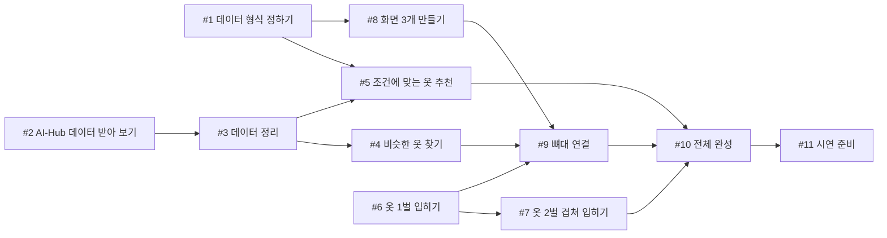

# 5주차 활동지 / Week 5 Worksheet

**1-page 기획서 / One-page plan**

- 작성일 / Date: 2026.10.02 
- 참여자 / Present: 정준영,허정민,장동호,김현빈

---

## ① 주제 확정 / Confirm topic

- 확정 주제 / Topic: 내 방 옷장의 옷과 새옷의 조합 확인하기
- 이유 / Reason: 온라인 의류 쇼핑은 직접 입어볼 수 없어서 사이즈나 핏이 맞을지 걱정하는 사람들이 많기 때문에 다른 후보들보다 사업성이 높다고 판단했습니다.

---

## ② 태스크 분해와 의존 관계 / Tasks and dependencies

### 태스크 목록 / Task list

4주차 사용자 스토리와 완료 조건을 태스크로 나눕니다.
*Break down your Week 4 user stories and acceptance criteria into tasks.*

각 태스크는 따로 끝내도 맞는지 확인할 수 있어야 합니다. 담당에 '다 같이'는 쓰지 않습니다.
*Each task must be checkable on its own. Do not write "everyone" as owner.*

| # | 태스크 | 완료 조건 | 선행 | 담당 |
|---|---|---|---|---|
| 1 | 데이터 형식 정하기 | 화면과 기능이 주고받을 항목(옷 이미지, 종류, 색상, 디자인)이 문서 한 장에 정리됨 | 없음 | 허정민 |
| 2 | AI-Hub 데이터 받아 보기 | API로 옷 이미지와 속성 1건을 받아 저장하고, 이용 조건을 확인해 기록함 | 없음 | 정준영 |
| 3 | 데이터 정리 | 상의·하의만 골라 각 500장 이상을 종류·색상·디자인 칸이 있는 표(CSV)로 정리하고, 디자인 선택지 목록을 확정함 | 2 | 정준영 |
| 4 | 비슷한 옷 찾기 | 테스트 사진 5장 중 4장 이상에서, 1위로 찾은 옷의 종류와 색상이 내 옷과 같음 | 3 | 장동호 |
| 5 | 조건에 맞는 옷 추천 | 색상·디자인을 고르면 조건에 맞고 내 옷과 다른 종류(상의 ↔ 하의)인 옷이 최대 5개 나오고, 없으면 안내 문구가 나옴 | 1, 3 | 장동호 |
| 6 | 아바타에 옷 1벌 입히기 | 기본 아바타에 샘플 상의 3벌을 각각 입힌 이미지가 나오고, 1장 만드는 데 걸린 시간이 기록됨 | 없음 | 김현빈 |
| 7 | 아바타에 옷 2벌 겹쳐 입히기 | 상의를 입은 아바타에 하의를 더 입혔을 때 상의 모양과 색이 그대로 유지됨 (샘플 3세트) | 6 | 김현빈 |
| 8 | 화면 3개 만들기 | 가짜 데이터로 ① 사진 올리기 → ② 조건 고르기 → ③ 결과 보기 화면을 버튼으로 넘겨 볼 수 있음 | 1 | 허정민 |
| 9 | 뼈대 연결 (Walking Skeleton) | 화면에서 내 옷 사진을 올리면 비슷한 옷을 입은 아바타 이미지가 뜸 | 4, 6, 8 | 허정민 |
| 10 | 전체 완성 | 조건을 고르면 추천 옷이 내 옷 입은 아바타에 겹쳐 입혀진 이미지까지 나오고, 3번 연속 오류 없이 동작함 | 5, 7, 9 | 김현빈 |
| 11 | 시연 준비 | 시연 대본, 리허설 1회, 인터넷·GPU가 안 될 때 보여줄 예비 결과 이미지가 준비됨 | 10 | 장동호 |

### 의존 관계 그래프 / Dependency graph (DAG)

화살표는 "앞 태스크가 끝나야 뒤 태스크를 할 수 있다"는 뜻입니다.
*An arrow means the first task must finish before the second can start.*

**그리는 방법 / How to draw**
- 아래 예시에서 상자 이름을 바꾸고, 선후 관계 하나마다 화살표(`-->`) 줄을 하나씩 추가합니다. GitHub에서 파일을 열면 그림으로 보입니다. 미리 보려면 mermaid.live에 붙여 넣으세요.
  *Rename the boxes and add one `-->` line per dependency. GitHub shows it as a diagram. Preview at mermaid.live.*
- 태스크 표를 AI에게 주고 "Mermaid 그래프로 바꿔 줘"라고 요청해도 됩니다.
  *You can also give the task table to AI and ask "Convert this into a Mermaid graph."*
- 어려우면 종이에 그려 사진을 `docs/images/`에 올리고 ``로 넣어도 됩니다.
  *Or draw it on paper, upload the photo to `docs/images/` and link it with ``.*

- 지금 착수 가능 (진입 차수 0) / Can start now (in-degree 0): #1, #2, #6
- 작업 순서 (위상정렬) / Work order (topological sort):
  - 1단계 (동시 시작): #1, #2, #6
  - 2단계: #3, #7, #8
  - 3단계: #4, #5
  - 4단계: #9 (뼈대 완성)
  - 5단계: #10
  - 6단계: #11
- 사이클이 있었다면 어떻게 풀었는가 / If there was a cycle, how did you fix it?: 화면을 만들려면 결과에 어떤 항목이 오는지 알아야 하고, 추천 기능은 화면이 어떤 값을 넘기는지 알아야 해서 서로 기다리는 사이클이 생길 뻔했다. 둘 다 필요한 결정인 "데이터 형식 정하기"(#1)를 맨 앞으로 빼서, 화면과 추천을 동시에 시작할 수 있게 했다.

---

## ③ 범위 결정 / Scope

### Must — 없으면 성립 안 됨 / essential

핵심 시나리오 1개가 끝까지 동작하는 데 필요한 것만 / *Only what the core scenario needs to work end-to-end*

- 핵심 시나리오 / Core scenario: 내 옷(상의 또는 하의) 사진 1장을 올리면 → 비슷한 옷을 찾아 아바타에 입히고 → 사고 싶은 옷의 색상·디자인을 고르면 조건에 맞는 옷이 추천되고 → 그중 고른 1벌이 내 옷을 입은 아바타에 겹쳐 입혀진 이미지가 나온다

### Should (없을 경우에는 작성하지 마세요)
 
 - 시나리오

### Could (없을 경우에는 작성하지 마세요)

 - 시나리오

### **Won't — 이번 학기에 안 함 / not this semester**

| Won't 항목 Item | 포기한 이유 Why |
|---|---|
|  |  |
|  |  |

### 실행 가능성 확인 / Feasibility check

- 특수 장비·유료 API·실제 개인정보가 필요한가? 필요하다면 대안은?
  *Does it need special hardware, paid APIs or real personal data? If so, what is the alternative?*
- 15주차에 발표장에서 시연할 수 있는 형태인가?
  *Can it be demonstrated live in Week 15?*

---

## ④ 가장 먼저 동작시킬 흐름 (Walking Skeleton) / First end-to-end flow

예 / Example: 과제 ID를 입력하면 → LMS에서 제출 기록을 받아 와서 → 화면에 제출 인원 숫자 하나가 뜬다

> [무엇을 입력하면] → [무엇을 처리해서] → [화면에 무엇이 나온다]
> 

---

> 수업 종료 시 커밋하세요 / Commit this at the end of class
> `git add docs/week-05.md && git commit -m "docs: 5주차 활동지 작성"`
